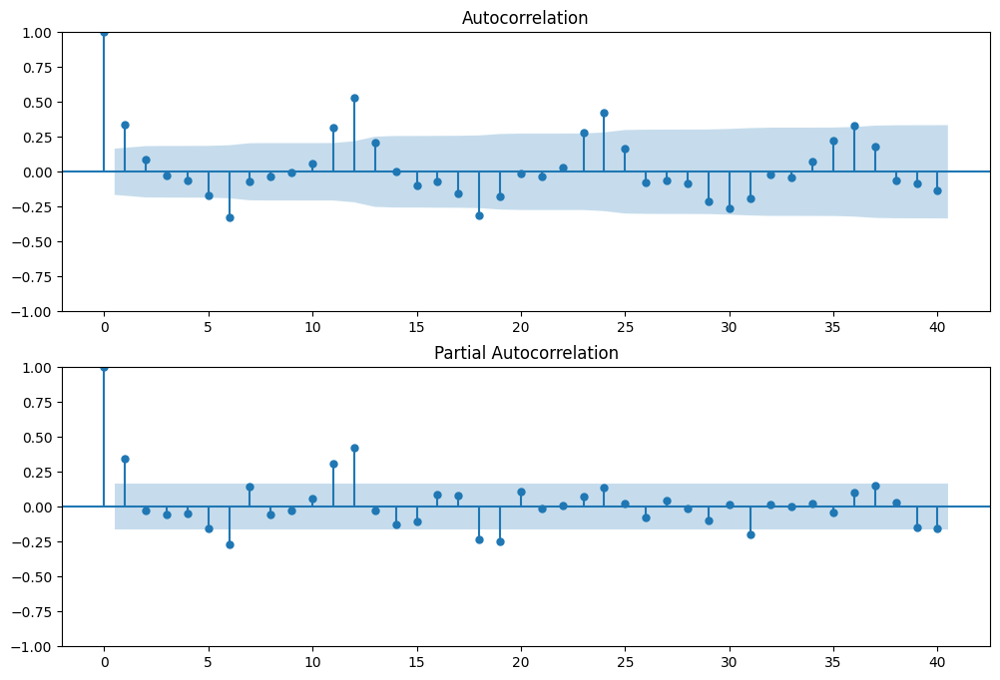

# **HOUSING MARKET**

Given the fact that the real estate market has many ups and downs regarding the properties values, it is important to know the economic impact it could have. This can vary over time and there can be economic situations that affect the market as in 2008, when a recessive period occurred.

This project is focused on the study of the real estate market in the United States. 
Different areas of this country will be analyzed to find the best places to make an investment. Several variables will be taken into account such as the property type, time, weather, personal income and crime rate.

# Technology Stack

All the raw data obtained from different web sources is stored in a S3 AWS bucket.
This data is then extracted from the bucket and transformed using Python, mostly Pandas library in order to have the information needed in a structured and uniform format.

Once the data is clean, it is uploaded to a different S3 bucket

The data is also uploaded to a MySQL database in the cloud using RDS from Amazon Web Services. One of the advantages of working in the cloud is that all members of the team can access the database from their computers and use the cloud storage resources. Some security rules are set so only certain IPs can have access. 

The processes of extraction, transformation and load are orchestrated using Apache Airflow DAGs. Working with Airflow helps monitoring and automatizing the pipelines. Also, the workflow can be visualized using the Airflow UI.
An incremental load is shown in this video: https://www.youtube.com/watch?v=3qUcwh5t-H8

## DER

The following image shows the Entity Relationship Diagram of our database.

# Machine Learning

We train different models to predict the house prices in the United States.

## Time Series

One approach is using a time series the Seasonal ARIMA model to predict the house prices in 2023.

### Why seasonal?

In the following image we can see there's a significant partial autocorrelation at 12. This means that the price at a certain month depends on the price at the same month a year before.

### Results

The Mean Absolute Percentage Error for this model is 1.09 %. 
The following image shows the house price predictions for 2023.

# Data analysis

It is detected that the states of New York, California and Florida have cities where a positive variation in the increase in sales prices is observed. Regarding the variation in rental prices, they also follow the same trend where the main cities of these states present a greater amount of collection for this concept.  

In 2012, the real estate market began to recover with respect to the variation in the sale price of last year, so that the sale prices do not present a variation of more than 20%. For the year 2013, the variation of the sale price with respect to last year may rise more than 40% in some areas. For the following years, the price variations with respect to previous years are positive, therefore, in general, the variations range from 10% to 20%.
It is detected that the type of property that presents the greatest price variations compared to previous years is condominium-type and duplex-type homes, while residential houses for a single family have a positive but constant variation.
 

It should be noted that the places with the highest prices are also places with a high demographic concentration. In addition to the fact that the purchase and rental of condominiums and duplex houses is increasing year after year. 

Except for 2018 where we had a small negative variation of 0.90% we can see that from 2012 to the present we have a constant positive variation of sales, with some peaks like in 2013 and 2015 of around 13%.  Although the current year is also having very low numbers compared to the previous year, we only work with data up to September so we will not rush to draw conclusions about 2022. 
In terms of sales movement we can see that the cities of Chicago, Houston and Los Angeles; and the states of California, Florida and Texas stand out. Also that this movement is concentrated yin the middle of the year. 
Taking into account this information we can say that the trend in terms of variation of home sales is positive, which is an interesting factor when investing. 
 
As for the population variation, we can see that from 2010 to the present the variations per year have been decreasing until 2020, with a surprising rebound in 2021. beyond that we can see that the population growth is constant, so we can conclude that the trend is increasing. 
In terms of population we can see that the cities of New York, Los Angeles and Phoenix; and the states of New York, California, and Texas stand out.

## Dashboard

The information within the dashboard is distributed by year and by state or city in the United States; This can be selected according to the area of interest and the available data for the area will be provided.

The dashboard contains an analysis of the following items:

## Disclaimer

This is our the final project from SoyHenry's Data Science bootcamp. It is just for educational purposes, we are not giving any finacial advise.
